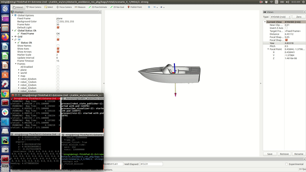

# IMU visualizer

This package visualize real-time odom (ROS topic) in a fixed x,y value. 
The visualization is based on boat.stl of which motion is affected by wave, currents.

## Author
Mingi Jeong

### Reference
https://github.com/bandasaikrishna/orientations_from_IMU_MPU_6050

